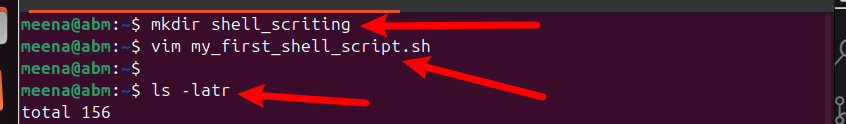
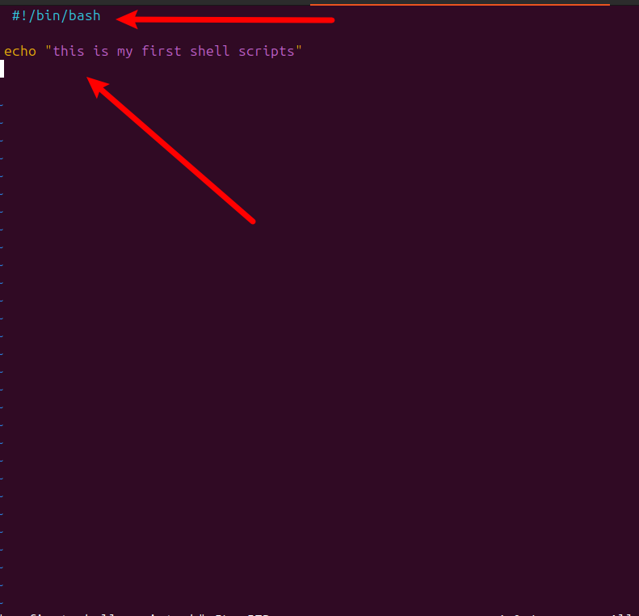
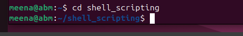
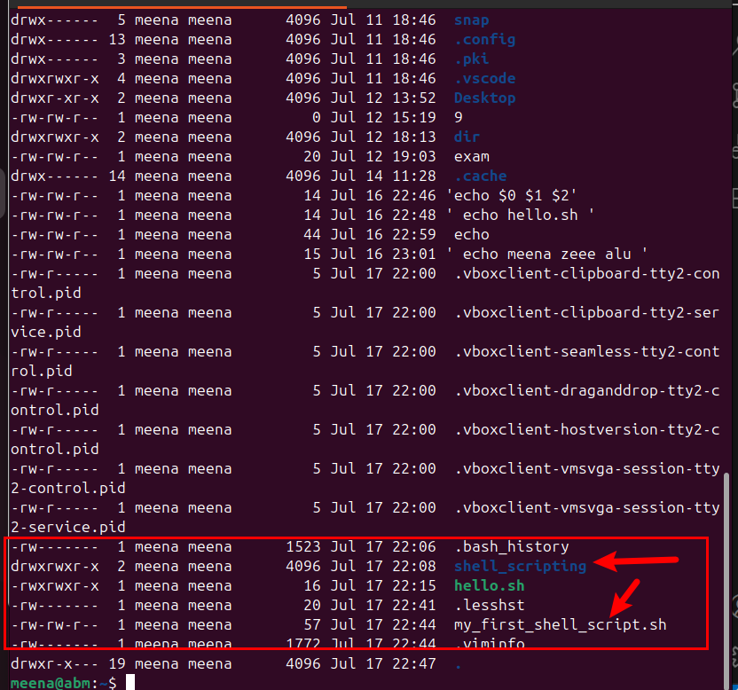
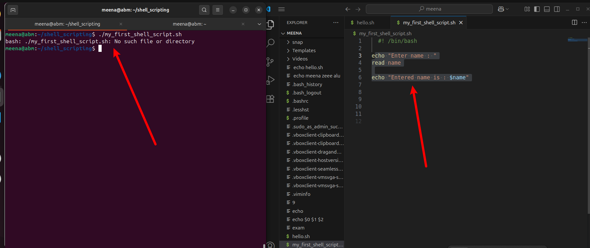
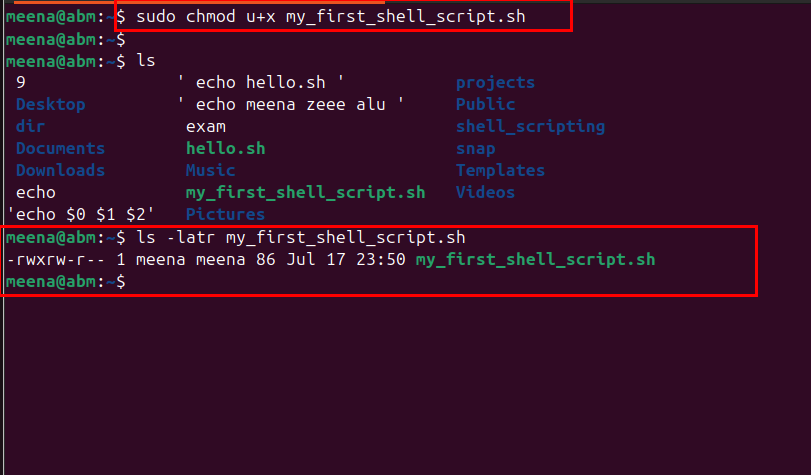
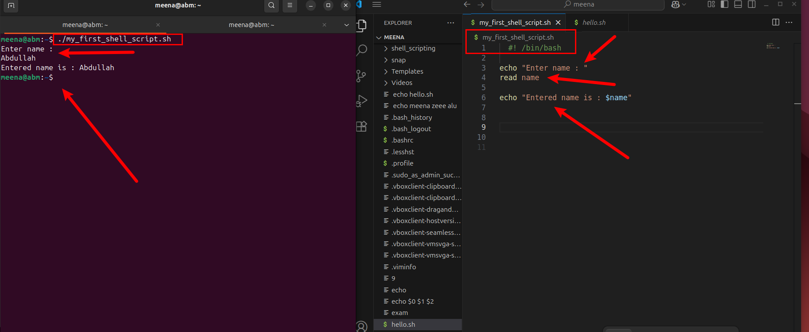
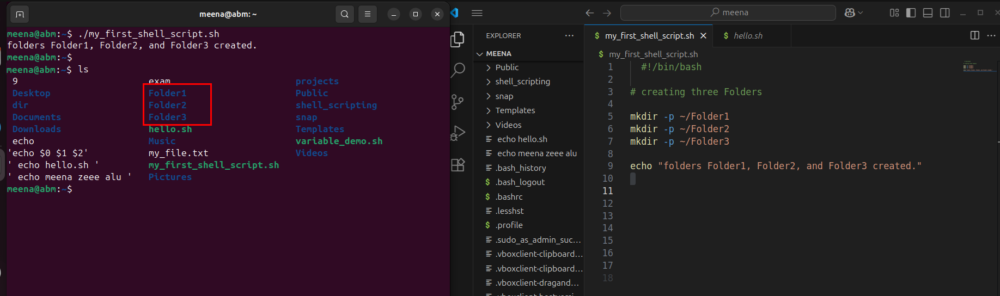
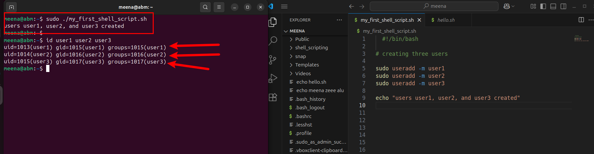
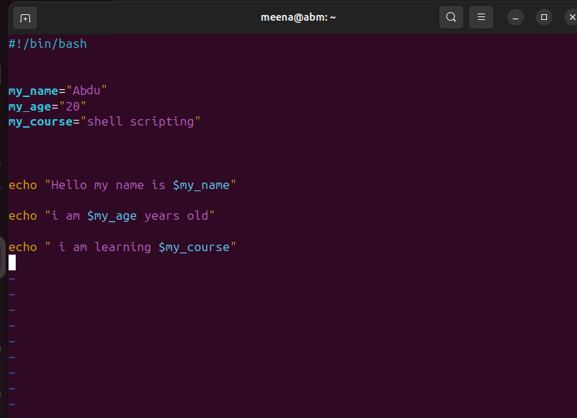

# Linux_Shell_Script
## Introduction.
In this project, we will explain the term shell scripting, showcase how you can create folder and file using vim Editor and how you can navigate through the vim Editor. Also, we will showcase how to execute the script , add the execute permission in a file, run shell script, create three folders and three users and how you can verify the folders and users you created. Furthermore, we will also explain the term and important of shebang, variables and how you can assign and retrieve value from a variables.

## 1. What is a shell and shell scripting? 

shell in a simple term, is the interpreter between the command line interface and operating system. while , shell scripting is the process of writing and executing a series of instructions in a shell to automate a task. It is a text file containing a  sequence of shell command and these commands are executed in order by the shell. Shell script is program written in a shell language, such as Bash, sh, zsh, or powershell. 

## TASK

In this session, we are going to perfom a simple task where we showcase the :

a. creation of folder and file using vim Editor : Here we are creating a folder and name it shell_scripting. "mkdir shell_scripting" this is the command you use to create a folder.
while to create a file using vim editor; "vim my-first_shell-script.sh" when you run this command , it will create a file and then take you directly into the vim editor interface.
.

 But you cannot write or perform any operation untill you press "i" which means insert. with that you could write, delete and make any edition you want. After, succussfully making your edtion, you press escape (esc), shipt and culumn and wq on your keyboard will automatically save your work and return you to the directory you re executing your work.
.

b. To navigate into the new folder we created, we run this command "cd shell_scripting" this mean change directory i.e to move from home directory to the newly created directory.
.

c. To verify and confirm that the file and directory is indeed created, you run ; "ls -latr"
.

When you look at it carefully , you see that the file look like this " -rw-rw-r-. That r means read, w means write. This means that 

- the owner of the file has only read and write permission

- members of the file group has also read and write permission

- and others have pnu read permissions . That is all of them have no execute permission.

## How To execute The script.
To execute a script you will do something like this 
./my_first_shell_script.sh.

Let me braek it down. that:

- the dot (.) represent the current directory.
- while the (/) is a directory separator.
so when you hit enter, you see response that you are not permitted or no such file or directory. And the reason why you seeing that is because the file you created has not executable permission.
. 

So now we re going to showcase how you can execute a file and then run your script successfully by :

a. running the command "sudo chmod u+x my_first_shell_script.sh" will now add execute permission to the file .
.

b. When you run the shell script again , it will be run successfully.
.

c. Evaluating to ensure that three folders are created in your script. we run these command which created the folders in our home directory;
## scripts 1: user and folder creation;

 - mkdir -p ~/Folder1
 - mkdir -p ~/Folder2
 - mkdir -p ~/Folder3

 and then echoed the folder by giving the command echo.
 

d. Evaluating and ensuring that three users are created within the script, using sudo command.

## What is Shebang ?
At the begining of shell we have something written like that "#!/bin/bash. this is what we call shebang. It is used to specify which type of shell you want the interpreter to use to execute the script. so it is very important, and without shebang line the system may not know how to interpret and execute a script.

## What is veriable ?
veriable is the container which store data of various types such as numbers, strings, and arrays inside them. For example = is used to assign value to a veriable and access the value using the variable name proceeded by a doller sign $. Example:

## Created variable_demo.sh file;
In this file we demonstrate as a beginner how variables are being used . we created the file using vim command and input variable.
.

And after we run the script, this is the output we got which shows that we successfully automate our task.

## conclusion
so this is a brief explantion of the term shell and shell scripting,and how you can assign value to a variable and print it out.

  

